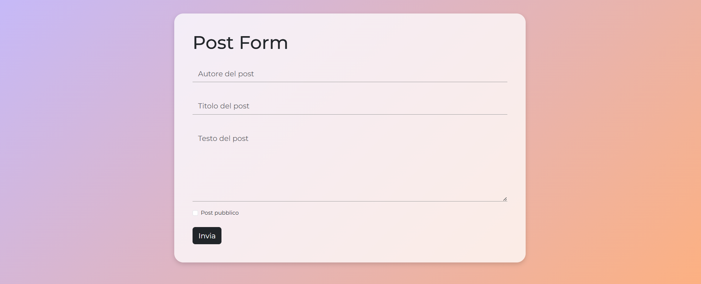

# react-post-form

## 🇬🇧 English Version

### Overview

React exercise focused on creating a multi-field form to send data via POST to a remote API for creating new blog posts.

### Assignment Summary

The assignment required to:

- Create a new React app containing a form to create a new blog post.
- Collect the following fields from the user:
  - `author` (string) – post author
  - `title` (string) – post title
  - `body` (string) – post content
  - `public` (boolean) – whether the post is public (`true`) or a draft (`false`)
- Send the form data with a POST request to the endpoint:
  - `https://67c5b4f3351c081993fb1ab6.mockapi.io/api/posts`
- Log the response in the console to verify that all data has been sent correctly.

---

## 🇮🇹 Versione Italiana

### Panoramica

Esercizio React dedicato alla creazione di un form multifield per inviare dati in POST a una API e creare nuovi post di blog.

### Riassunto della Consegna

La consegna richiedeva di:

- Creare una nuova app React che contenga un form per la creazione di un nuovo post del blog.
- Raccogliere dall’utente i seguenti campi:
  - `author` (string) – autore del post
  - `title` (string) – titolo del post
  - `body` (string) – testo del post
  - `public` (boolean) – se il post deve essere pubblico (`true`) o una bozza (`false`)
- Inviare i dati del form con una richiesta POST all’endpoint:
  - `https://67c5b4f3351c081993fb1ab6.mockapi.io/api/posts`
- Stampare in console la risposta dell’API per verificare che i dati siano stati inviati correttamente.
